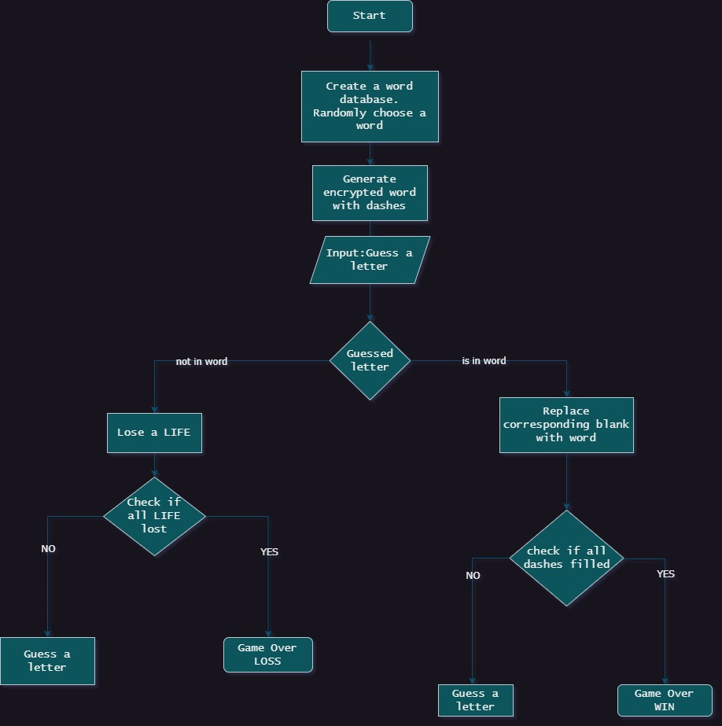

# hangman game


-  " Word guessing game, you will be hanged to death in steps for wrong guesses 😁"

## code flow (flow chart)

> start --> generate a word --> generate dash which rep letter in that word --> <br>  _Guess a letter_ --> <br>
{Guessed letter is in the word} -{YES}-> {check if all dashes filled} -{NO}-> _Guess a letter_ <br> {check if all dashes filled} -{YES}-> __Game Over__(you win) <br>
_Guess a letter_ --> <br>
{Guessed letter is in the word} -{NO}-> [lose a life!] --> {check if all lives lost} -{NO}-> _Guess a letter_ <br> check if all lives lost -{YES}-> __Game Over__(you loss)



## required functions:
- hangman life stages in diagram


```python
# hangman life stages in diagram
def hangman_life(life_stage):

    if life_stage == 1:
        print("/-----|")
        print("|     O")
        print("|     ")
        print("|      ")
        print("|      ")
        print("--     ")
    
    elif (life_stage == 2):
        print("/-----|")
        print("|     O")
        print("|     |")
        print("|      ")
        print("|      ")
        print("--     ")
    
    elif (life_stage ==3):
        print("/-----|")
        print("|     O")
        print("|     |\\")
        print("|      ")
        print("|      ")
        print("--     ")

    elif (life_stage ==4):
        print("/-----|")
        print("|     O")
        print("|    /|\\")
        print("|      ")
        print("|      ")
        print("--     ")
    
    elif (life_stage ==5):
        print("/-----|")
        print("|     O")
        print("|    /|\\")
        print("|      \\")
        print("|      ")
        print("--     ")

    elif (life_stage ==6):
        print("/-----|")
        print("|     O")
        print("|    /|\\")
        print("|    / \\")
        print("|      ")
        print("--     ")

    return None
    
# for i in range(0,7):
#     hangman_life(i)
#     i=i+1
```


```python
# another format of above hangman function in list

#file1 : hangman_lives.py

hangman = [
  '''     /-----|
     |     O
     |    /|\\
     |    / \\
     |      
     --     ''' ,
'''     /-----|
     |     O
     |    /|\\
     |    / 
     |      
     --     ''',
  '''     /-----|
     |     O
     |    /|\\
     |   
     |      
     --     ''',
  '''     /-----|
     |     O
     |    /|
     |    
     |      
     --     ''',
  '''     /-----|
     |     O
     |     |
     |    
     |      
     --     ''',
  '''     /-----|
     |     O
     |   
     |    
     |      
     --     '''
]


# for i in range(0,7):    
#     print(hangman[i])
#     i+=1
```

## n_coding
- that is myself looking for algo
- to know about a module use: help(random)

### word database & random,choice


```python
words_database = ["classic",
         "game",
         "favorite",
         "disparate",
         "quack",
         "upset",
         "electrons",
         "replenish",
         "whimsical",
         "orthodoxy",
         "labyrinth",
         "nocturnal",
         "programme",
         "symposium",
         "trimester",
         "ultimatum",
         "zombifies"]
```


```python
#n_code0
# needs : lst of words, random,
# randomly gives a word

import random 
word_to_be_guessed = random.choice(words_database)
lst_word_to_be_guessed = list(word_to_be_guessed)
lst_word_to_be_guessed
```


```python
# simplifying variable name
import random
choosen_word = random.choice(words_database)
#list format of the choosen word
lst_choosen_word = list(choosen_word)
lst_choosen_word
```


    ['p', 'r', 'o', 'g', 'r', 'a', 'm', 'm', 'e']


### encrypting choosen word


```python
#n_code1
# word's letter replaced with dashes --> encrypted variable
encrpt_word_with_dash = []
for i in range(len(word_to_be_guessed)):
    encrpt_word_with_dash.append('_')
encrpt_word_with_dash
```


```python
#simplification
encrypt_word = []
for letter in range(len(choosen_word)):
    encrypt_word +='_'
encrypt_word   #testing

```


    ['_', '_', '_', '_', '_', '_', '_', '_', '_']


### main code

_Guess a letter_ --> {Guessed letter is in the word} -{NO}-> [lose a life!] --> {check if all lives lost} -{NO}-> _Guess a letter_ <br> check if all lives lost -{YES}-> __Game Over__(you loss)) <br> 
--- ---
_Guess a letter_ --> {Guessed letter is in the word} -{YES}-> {check if all dashes filled} -{NO}-> _Guess a letter_ <br> {check if all dashes filled} -{YES}-> __Game Over__(you win)


```python
# main code

# modules:
import random

choosen_word = random.choice(words_database)
print(choosen_word)
# encrypting the word
encrypt_word = []
for letter in range(len(choosen_word)):
    encrypt_word += '_'
print(encrypt_word)

# user input

lives = 6
game_over = False

while not game_over:
    # let user input be in lowercase
    user_letter = input("enter a letter: ").lower()
    #checking user letter with letter in choosen word
    # for letter in choosen_word:
    #     location =0
    #     location = choosen_word.index(letter)
    #     if letter == user_letter:
    #         encrypt_word[location] = letter
    #     location +=1

    # checking user letter with letter in choosen word using index
    for location in range(len(choosen_word)):
        letter = choosen_word[location]
        if letter == user_letter:
            encrypt_word[location] = letter
    print(encrypt_word)

    if user_letter not in choosen_word:
        lives -=1
        print(hangman[lives])
        if lives == 0:
            print("you loss")
            game_over = True

    #if user_letter in choosen_word:
    if "_" not in encrypt_word:
        print("you won")
        game_over = True 
    
```
- output 
```

    programme
    ['_', '_', '_', '_', '_', '_', '_', '_', '_']
    

    enter a letter:  m
    

    ['_', '_', '_', '_', '_', '_', 'm', 'm', '_']
    

    enter a letter:  ww
    

    ['_', '_', '_', '_', '_', '_', 'm', 'm', '_']
         /-----|
         |     O
         |   
         |    
         |      
         --     
    

    enter a letter:  s
    

    ['_', '_', '_', '_', '_', '_', 'm', 'm', '_']
         /-----|
         |     O
         |     |
         |    
         |      
         --     
    

    enter a letter:  ss
    

    ['_', '_', '_', '_', '_', '_', 'm', 'm', '_']
         /-----|
         |     O
         |    /|
         |    
         |      
         --     
    

    enter a letter:  df
    

    ['_', '_', '_', '_', '_', '_', 'm', 'm', '_']
         /-----|
         |     O
         |    /|\
         |   
         |      
         --     
    

    enter a letter:  d
    

    ['_', '_', '_', '_', '_', '_', 'm', 'm', '_']
         /-----|
         |     O
         |    /|\
         |    / 
         |      
         --     
    

    enter a letter:  a
    

    ['_', '_', '_', '_', '_', 'a', 'm', 'm', '_']
    

    enter a letter:  a
    

    ['_', '_', '_', '_', '_', 'a', 'm', 'm', '_']
    

    enter a letter:  
    

    ['_', '_', '_', '_', '_', 'a', 'm', 'm', '_']
    

    enter a letter:  z
    

    ['_', '_', '_', '_', '_', 'a', 'm', 'm', '_']
         /-----|
         |     O
         |    /|\
         |    / \
         |      
         --     
    you loss
```   
---
---
## rough codes(trivials)


```python
#n_code0
# needs : lst of words, random,
# randomly gives a word

# import random 

# words_database = ["diligence","exquisite","abreast","doggyd"]
# word_to_be_guessed = random.choice(words_database)
# lst_word_to_be_guessed = list(word_to_be_guessed)
# lst_word_to_be_guessed

#n_code1
# word's letter replaced with dashes --> encrypted variable
encrpt_word_with_dash = []
for i in range(len(word_to_be_guessed)):
    encrpt_word_with_dash.append('_')
encrpt_word_with_dash

#n_code2
# user starts guessing the letter
GUESS_LIMIT = 6
wrong_guess = 0


while wrong_guess < GUESS_LIMIT:
    user_guess_letter = input("Guess a letter: ")
    guessed_letter = []
                         
    if user_guess_letter not in lst_word_to_be_guessed :
        wrong_guess+=1
        hangman_life(wrong_guess)
        if wrong_guess != GUESS_LIMIT:
            continue
        else:
            print("__Game Over__{you loss}")
            break
    else :
        if user_guess_letter in guessed_letter:
            continue
        else:
            if encrpt_word_with_dash != lst_word_to_be_guessed:
                guessed_letter.append(user_guess_letter)
                for i in lst_word_to_be_guessed:
                    if  i == user_guess_letter:
                        indx = lst_word_to_be_guessed.index(user_guess_letter)
                        lst_word_to_be_guessed.pop(indx)
                        encrpt_word_with_dash.pop(indx)
                        encrpt_word_with_dash.insert(indx,user_guess_letter)
                print(encrpt_word_with_dash)
            else:
                print("__Game Over__{you win}")
                break
            
print("game 0ver__guess limits you")                 
    
```

_Guess a letter_ --> {Guessed letter is in the word} -{YES}-> {check if all dashes filled} -{NO}-> _Guess a letter_ <br> {check if all dashes filled} -{YES}-> __Game Over__(you win)


```python
lst_word_to_be_guessed
# print(lst_word_to_be_guessed.index('g'))
```


    ['d', 'i', 'l', 'i', 'e', 'n', 'c', 'e']


```python
user_guess_letter = input("Guess a letter: ")
if user_guess_letter in lst_word_to_be_guessed :
    print(encrpt_word_with_dash)
    encrpt_word_with_dash.pop(lst_word_to_be_guessed.index(user_guess_letter))
    print(encrpt_word_with_dash)
```

    Guess a letter:  d
    

    ['_', '_', '_']
    ['_', '_']
    


```python
# test0
# a = 'doggyy'
# b = list(a)
# i=0
# for j in b:
#     if j == 'g':
#         i+=1


#test0.1
a = 'doggyy'
b = list(a)
c = ['-']*len(b)
print("c is: ",c)
i=0
for j in b:
    i+=1
    if j == 'g':
        c.pop(i-1)
        c.insert(i-1,'b')
print("c after is: ",c)
c[0] = 'd'
c[1] = 'o'
c[2] = 'g'
c[3] = 'g'
c[4] = 'y'
c[5] = 'y'

if c == b:
    print('=')
else:
    print("!=")
print(''.join(c))
# #test1
# a = input("enter: ")
# f = []
# f.append(a)
# f


# test 2
#uni que character count
unique = len(set(c))
unique
```

    c is:  ['-', '-', '-', '-', '-', '-']
    c after is:  ['-', '-', 'b', 'b', '-', '-']
    =
    doggyy
    

```python
#n_code0
# needs : lst of words, random,
# randomly gives a word

import random 

words_database = ["diligence","exquisite","abreast","doggyd"]
word_to_be_guessed = random.choice(words_database)
lst_word_to_be_guessed = list(word_to_be_guessed)
lst_word_to_be_guessed

  
```


    ['a', 'b', 'r', 'e', 'a', 's', 't']


```python
#n_code1
# word's letter replaced with dashes --> encrypted variable
encrpt_word_with_dash = []
for i in range(len(word_to_be_guessed)):
    encrpt_word_with_dash.append('_')


```

### full


```python
import random 
# functions used
def hangman_life(life_stage):

    if life_stage == 1:
        print("/-----|")
        print("|     O")
        print("|     ")
        print("|      ")
        print("|      ")
        print("--     ")
    
    elif (life_stage == 2):
        print("/-----|")
        print("|     O")
        print("|     |")
        print("|      ")
        print("|      ")
        print("--     ")
    
    elif (life_stage ==3):
        print("/-----|")
        print("|     O")
        print("|     |\\")
        print("|      ")
        print("|      ")
        print("--     ")

    elif (life_stage ==4):
        print("/-----|")
        print("|     O")
        print("|    /|\\")
        print("|      ")
        print("|      ")
        print("--     ")
    
    elif (life_stage ==5):
        print("/-----|")
        print("|     O")
        print("|    /|\\")
        print("|      \\")
        print("|      ")
        print("--     ")

    elif (life_stage ==6):
        print("/-----|")
        print("|     O")
        print("|    /|\\")
        print("|    / \\")
        print("|      ")
        print("--     ")

    return None


words_database = ["diligence","exquisite","abreast","doggyd"]
word_to_be_guessed = random.choice(words_database)
lst_word_to_be_guessed = list(word_to_be_guessed)
lst_word_to_be_guessed
# unique_word_to_be_guessed = len(set(lst_word_to_be_guessed))

#n_code1
# word's letter replaced with dashes --> encrypted variable
encrpt_word_with_dash = []
for i in range(len(word_to_be_guessed)):
    encrpt_word_with_dash.append('_')

print(encrpt_word_with_dash)
#n_code2
# user starts guessing the letter
user_guess = 0
WRONG_GUESS_LIMIT = 6
wrong_guess = 0
right_guessed_letter = []

while encrpt_word_with_dash != lst_word_to_be_guessed:
    user_guess_letter = input("Guess a letter: ")
    user_guess +=1
                         
    if user_guess_letter not in lst_word_to_be_guessed :
        wrong_guess+=1
        hangman_life(wrong_guess)
        if wrong_guess != WRONG_GUESS_LIMIT:
            continue
        else:
            print("__Game Over__{you loss}")
            break
    else :
        if user_guess_letter in right_guessed_letter and len(right_guessed_letter) < len(set((lst_word_to_be_guessed))):
            continue
        
        else:
            if encrpt_word_with_dash == lst_word_to_be_guessed:
                print(''.join(encrpt_word_with_dash))
                print("__Game Over__{you win}")
                break
        
            else:
                right_guessed_letter.append(user_guess_letter)
                j =0
                for i in lst_word_to_be_guessed:
                    j+=1
                    if  i == user_guess_letter:
                        # lst_word_to_be_guessed.pop(indx)
                        encrpt_word_with_dash.pop(j-1)
                        encrpt_word_with_dash.insert(j-1,user_guess_letter)
                print(encrpt_word_with_dash)

print("__Game Over__{you win}")
# print("game 0ver__guessing limits 0ver") this need a flag to trigger it
```

    ['_', '_', '_', '_', '_', '_', '_', '_', '_']
    

    Guess a letter:  d
    

    ['d', '_', '_', '_', '_', '_', '_', '_', '_']
    

    Guess a letter:  i
    

    ['d', 'i', '_', 'i', '_', '_', '_', '_', '_']
    

    Guess a letter:  z
    

    /-----|
    |     O
    |     
    |      
    |      
    --     
    

    Guess a letter:  li
    

    /-----|
    |     O
    |     |
    |      
    |      
    --     
    

    Guess a letter:  l
    

    ['d', 'i', 'l', 'i', '_', '_', '_', '_', '_']
    

    Guess a letter:  g
    

    ['d', 'i', 'l', 'i', 'g', '_', '_', '_', '_']
    

    Guess a letter:  e
    

    ['d', 'i', 'l', 'i', 'g', 'e', '_', '_', 'e']
    

    Guess a letter:  c
    

    ['d', 'i', 'l', 'i', 'g', 'e', '_', 'c', 'e']
    

    Guess a letter:  n
    

    ['d', 'i', 'l', 'i', 'g', 'e', 'n', 'c', 'e']
    __Game Over__{you win}
    

